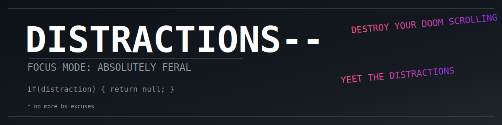

# 🧠 Distractions--(Distractions minus minus)
_(lame ahh name ik)_


---
## What is This?

Distractions-- is an intentionally irreversible distraction blocker for Linux. Once activated, it blocks distracting websites with absolutely no way to undo it until the timer expires. Perfect for when you're sick of your own procrastination and need the digital equivalent of throwing your phone into a time-locked safe.

## ⚠️ WARNING ⚠️

**THIS BLOCK CANNOT BE REVERSED UNTIL THE TIMER ENDS.**

Seriously, no joking. This tool:
- Makes the hosts file immutable (even to root)
- Survives system reboots
- Uses multiple fail-safe mechanisms to maintain the block
- Will not bend to your desperate attempts to regain access

If you need something gentler, this isn't the tool for you.

## Features

- **Absolutely Irreversible:** No backdoors, no overrides, no mercy
- **Multiple Block Categories:**
  - Social Media (Facebook, Twitter, Reddit, Instagram, TikTok, etc.)
  - Adult Content (Various sites that destroy productivity, e.g: pH (orange-black site, u remember?)
  - Time Wasters (YouTube, Netflix, Twitch, Hulu, etc.)
- **Flexible Duration:** Block for minutes, hours, or days
- **Custom Sites:** Add your own distraction domains
- **Visual Countdown:** Optional timer to show when your internet freedom returns
- **System Persistence:** Blocks survive reboots and power cycles
- **Simple GUI:** Easy to use (but hard to circumvent)

## Requirements

- Linux system with root/sudo access
- Dependencies:
  - zenity (for GUI)
  - at (for scheduling)
  - chattr (for making files immutable)
  - systemd-run (for timer services)
  - yad (optional, for countdown display)

## Installation

1. Clone this repository:
   ```bash
   git clone https://github.com/moron6554/distractions--
   cd distractions--
   ```

2. Make the script executable:
   ```bash
   chmod +x distractions--.sh
   ```

3. Install dependencies (if needed):
   ```bash
   sudo apt install zenity at chattr yad
   ```

## Usage

1. Run the script with sudo:
   ```bash
   sudo ./distractions--.sh
   ```

2. Configure your block via the GUI:
   - Choose block duration
   - Select preset categories or enter custom sites
   - Confirm (after the FINAL WARNING)

3. Experience forced productivity

4. Wait for the timer to expire (no shortcuts!)

## How It Works

The script:
1. Modifies your `/etc/hosts` file to redirect distracting domains to localhost
2. Makes the hosts file immutable with `chattr +i`
3. Creates systemd services to ensure block persistence
4. Sets up multiple timers to remove the block when your set time expires
5. Creates countdown display (optional)

## FAQ

**Q: I desperately need to access a blocked site! How do I disable it?**  
A: You don't. That's the whole point. Wait for the timer to expire.

**Q: Will this work on Windows/Mac?**  
A: No, this script is designed for Linux systems. Similar principles could be applied to other OSes but this implementation is Linux-specific. I will try to make a Windows/Mac version of this.

**Q: Can I edit the list of blocked sites?**  
A: Yes, before activating the block. After that, no.

**Q: What if there's an emergency?**  
A: Define "emergency." If you truly have an urgent need to access a blocked site, you'd need to use a different device or network. Consider this before setting long block periods.

## ‼️ Disclaimer

This tool is provided as-it-is with no warranties. The author is not responsible for any productivity gains, withdrawal symptoms, or existential crises that may result from using this software.
I developed this to block certain sites that ruined my productivity online weeks before my IGCSEs. With the help of Google, my friend and my limited programming knowledge i attempted to develop this. It just works for me, so i decided to share it so that it can be beneficial to others. If you find this helpful pls consider starring.

## 🔐 What Makes It Different? _(or so i believe it is different)_

| Feature | Distractions | Normal Blockers |
|--------|---------------|------------------|
| Root-proof lock | ✅ | ❌ |
| GUI (Zenity) | ✅ | ❌ |
| Works offline | ✅ | ❌ |
| Countdown view | ✅ | ❌ |
| Auto unblock | ✅ | ⚠️ (manual) |

---

## 📷 Screenshots

| Blocking Prompt | Countdown View |
|------------------|----------------|
|  |  |

---

## 📝 To-Do / Ideas

- [x] Add auto-restart blocker on reboot (via cron)
- [ ] Block on schedule (e.g., 8am–10am daily)
- [ ] GUI version with GTK or Python frontend
- [ ] Windows and Mac version

---
## Note:
I am open to any suggestions, so if you believe you have a certain feature in mind and want it to be implemented or a certain bug then pls contact me or create an issue.
Thanks.
---
## 🧑‍💻 Author & Contact

**Distractions--** by [moron6554]

- 📧 Email: govinpaul2008@gmail.com
- 🌐 Discord: @moron65
- 🐙 GitHub: (https://github.com/moron6554)

---

## 🖼️ License
GNU GENERAL PUBLIC LICENSE License.
---

*"Your future self will thank you for using this, even if your present self hates it."*
> ✨ Stay focused, stay free from distractions. You deserve to win king. 💪
